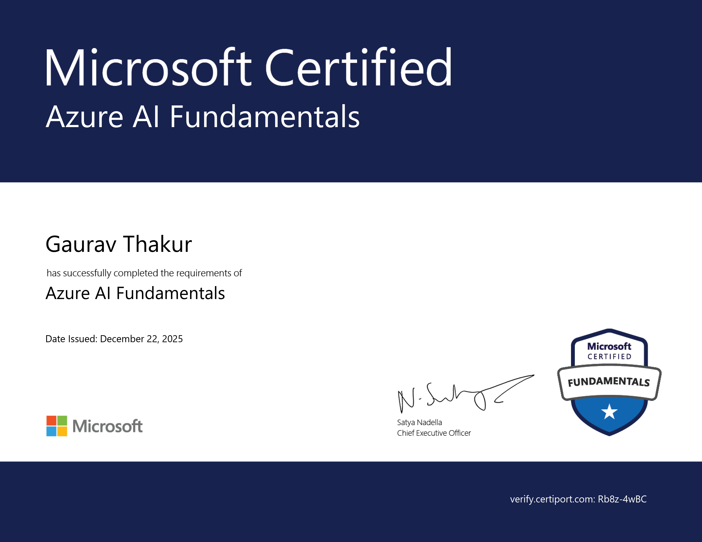
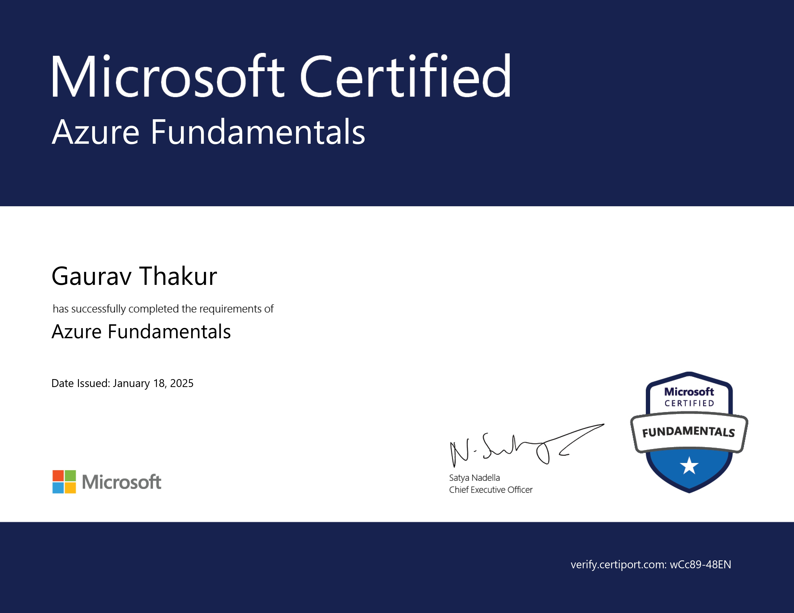

<!-- =============================== -->
<!--     CERTIFICATIONS SHOWCASE     -->
<!-- =============================== -->

# 🎓 Professional Certifications

---

## 📜 Microsoft Certified: Azure AI Fundamentals (2025)

  

🔗 **Download Certificate:**  
👉 [View / Download](AZURE_AI_FUNDAMENTALS_2025.jpg)

### 🧠 About This Certification
This certification validates my understanding of **Artificial Intelligence workloads and services on Microsoft Azure**, including machine learning, computer vision, NLP, and responsible AI concepts.

**Skills Validated**
- AI workloads & use cases  
- Machine Learning basics  
- Computer Vision & NLP fundamentals  
- Responsible AI principles  

**Issued:** December 22, 2025

---

## 📜 Microsoft Certified: Azure Fundamentals (2025)

  

🔗 **Download Certificate:**  
👉 [View / Download](AZURE_FUNDAMENTALS_2025.jpg)

### ☁️ About This Certification
This certification demonstrates my foundational knowledge of **cloud concepts, Azure services, security, pricing, and governance** on Microsoft Azure.

**Skills Validated**
- Cloud concepts  
- Core Azure services  
- Security, privacy & compliance  
- Azure pricing & support  

**Issued:** January 18, 2025

---

## 📊 Certifications Summary

| # | Certification | Platform | Year |
|---|---------------|----------|------|
| 1 | Azure AI Fundamentals | Microsoft | 2025 |
| 2 | Azure Fundamentals | Microsoft | 2025 |

---

## 🚀 Purpose of This Repository
This repository serves as **verified proof of my Microsoft certifications**, reflecting my commitment to **cloud computing, AI fundamentals, and continuous learning**.

⭐ *This repository will be updated as I earn more certifications.*

