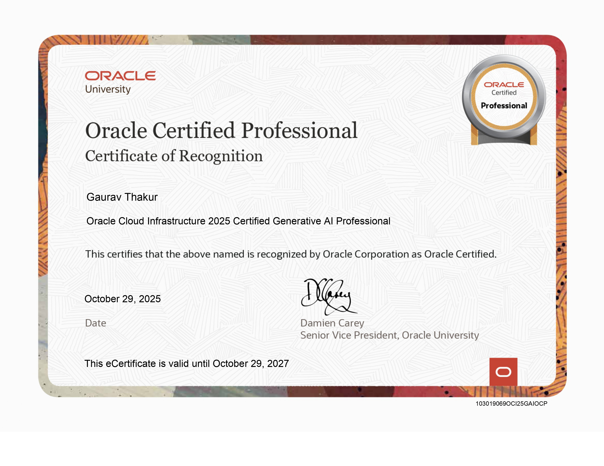

<!-- =============================== -->
<!--     CERTIFICATION SHOWCASE      -->
<!-- =============================== -->

# 🎓 Professional Certification

---

## 📜 Oracle Cloud Infrastructure – Certified Generative AI Professional (2025)

  

🔗 **Download Certificate:**  
👉 [Click here to view/download](Oracle_Generative_AI_Professional_2025.jpg)

---

## 🧠 About This Certification
This certification validates my knowledge and understanding of **Generative Artificial Intelligence concepts and applications on cloud platforms**.

It demonstrates my ability to:
- Understand **Generative AI fundamentals**
- Work with **Large Language Models (LLMs)**
- Apply **prompt engineering techniques**
- Understand **cloud-based AI services**
- Follow **ethical and responsible AI practices**

---

## 🏅 Certification Details

| Field | Information |
|------|-------------|
| Certification | Certified Generative AI Professional |
| Year | 2025 |
| Domain | AI • Generative AI • Cloud |
| Credential Type | Professional Certification |

---

## 🚀 Purpose
This repository serves as **verified proof of my certification** and reflects my commitment to **continuous learning and professional growth**.

⭐ *This repository will be updated as I earn more certifications.*
